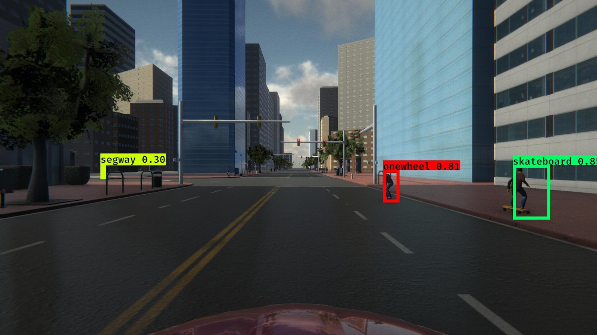
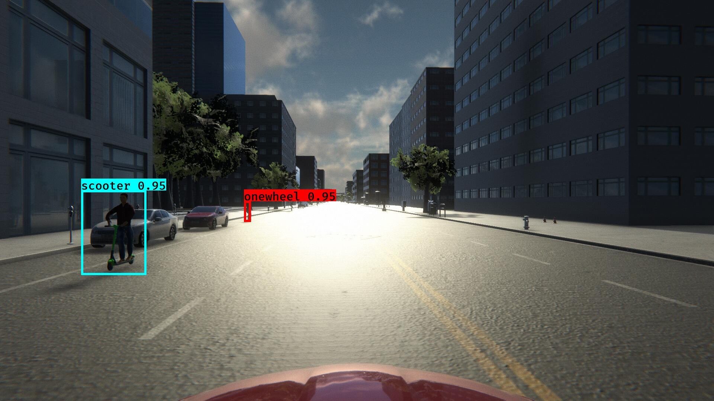

# CMPE 256 - Fall 2019 Project: Team Surreal
## Evaluating Validity of Synthetic data in Perception tasks for Autonomous Vehicles

The original implementation of YOLOv3 comes from [qqwweee/keras-yolo3](https://github.com/qqwweee/keras-yolo3). This repository contains the modified implementation for the datasets mentioned below and in the project report. This repository also contains code for data collection from LGSVL Simulators written as ROS (Robot Operating System) Nodes, as well as data processing and evaluation scripts.

[](LICENSE)

## Introduction
## Quick Start

1. Download pretrained weights [here](https://www.dropbox.com/s/a44ly3zd6bzmssw/2d-final-weights-keras-yolo3.h5?dl=0).
2. Move the downloaded .h5 file inside [model_data](model_data)
3. Run YOLO detection.
```
python inference.py [OPTIONS...] --image, for image detection mode
```

### Usage
Use --help to see usage of inference.py:
```
usage: inference.py [-h] [--model MODEL] [--anchors ANCHORS]
                     [--classes CLASSES] [--gpu_num GPU_NUM] [--image]

required arguments:
  --image            Image detection mode

optional arguments:
  -h, --help         show this help message and exit
  --model MODEL      path to model weight file, default model_data/yolo.h5
  --anchors ANCHORS  path to anchor definitions, default
                     model_data/yolo_anchors.txt
  --classes CLASSES  path to class definitions, default
                     model_data/coco_classes.txt
  --gpu_num GPU_NUM  Number of GPU to use, default 1
```


## Data Collection
### Simulated Datasets
For this project, we collected data from two different versions of LGSVL Automotive Simulator by writing ROS Nodes and connecting to the simulators over ROS Bridge. For more details on how the LGSVL Simulator works please visit the links below

#### [LGSVL 2019.05 Release (Sim1)](https://github.com/lgsvl/simulator-2019.05-obsolete)
#### [LGSVL 2019.10 Release (Sim2)](https://github.com/lgsvl/simulator)

The ROS packages written for collected data from the above mentioned simulators are provided in ??[]() folder. If you wish to run them, please copy the packages into your catkin workspace and run `catkin_make` to build these packages.

If you wish to download the collected datasets please download the zip files linked below

#### [LGVSL Sim1 Dataset]()
#### [LGSVL Sim2 Dataset]()

These zip files contain the front camera 2D images as well as the ground truth information in a single CSV file.

### Real-World Datasets
## Waymo Dataset: Extracting into Google Cloud Project buckets
1. Download the waymo dataset files(first 3 only for images training) [here](https://waymo.com/open/download/#)
2. Extract the tar file to get the list of segments.
3. Submit the path of all the segments to [training_data_to_gcs.ipynb](https://github.com/saching13/Validation-of-Synthetic-Image-data-for-Autonomous-Driving/blob/master/training_data_to_gcs.ipynb) or [validation_to_gcs.ipynb](https://github.com/saching13/Validation-of-Synthetic-Image-data-for-Autonomous-Driving/blob/master/validation_to_gcs.ipynb)
4. Update the cloud bucket path in the notebook to write the extracted images, tf records and annotation file to google cloud storage.

#### [Training_data_to_gcs.ipynb](https://github.com/saching13/Validation-of-Synthetic-Image-data-for-Autonomous-Driving/blob/master/training_data_to_gcs.ipynb) 
This files takes list of tfrecords of waymo from local or gcp buckets as input and creates tfrecords in the the cloud buckets.

#### [validation_to_gcs.ipynb](https://github.com/saching13/Validation-of-Synthetic-Image-data-for-Autonomous-Driving/blob/master/validation_to_gcs.ipynb)
This files also takes list of tfrecords of waymo from local or gcp buckets as input and creates tfrecords along with jpeg files and annotation file in the the cloud bucket.

#### TFRecord prototxt format:
TFRecord of waymo had more information including LIDAR scan with their own proto format. we simplified it to the following format with only images and it's annotations.

Our TFrecord format.
```

feature={
      'image/filename': dataset_util.bytes_feature(filename),
      'image/format': dataset_util.bytes_feature(image_format),
      'image/encoded': dataset_util.bytes_feature(encoded_image_data),
      'image/object/bbox/center_x': dataset_util.float_list_feature(center_x),
      'image/object/bbox/center_y': dataset_util.float_list_feature(center_y),
      'image/object/bbox/width': dataset_util.float_list_feature(width),
      'image/object/bbox/height': dataset_util.float_list_feature(height),
      'image/object/class/text': dataset_util.bytes_list_feature(classes_text),
      'image/object/class/label': dataset_util.int64_list_feature(classes),
  }

```

### KITTI Dataset: Converting KITTI dataset to YOLOV3 finput format

1. KITTI dataset is a stero camera dataset.
2. Dataset is of the format that each image contains it's individual text file which contains the class name, bounding box and other information.
3. we needed to convert it into single annotation file with bounding box, class. 
4. pass the list of annotation files of kitti dataset into [annotation_converter_kitti.py](https://github.com/saching13/Validation-of-Synthetic-Image-data-for-Autonomous-Driving/blob/master/annotation_converter_kitti.py) to create a single annotation file.

KITTI dataset can be found [here](http://www.cvlibs.net/datasets/kitti/eval_object.php?obj_benchmark=2d)

#### [image annotator.ipynb](https://github.com/saching13/Validation-of-Synthetic-Image-data-for-Autonomous-Driving/blob/master/image%20annotator.ipynb)

  On passsing the images folder path  and annotation file with bounding boxes it will generate images with bounding boxes for visualization. set `gcs = False` to create the output files in local file system and `True` to create files in GCP.


### ROS
If you are trying to run inferences on LGSVL simulators using ROS nodes, `get_detections` function in `yolo.py` returns 2D bounding box information.

ROS nodes that were created for this project are available [here](https://github.com/deepaktalwardt/lgsvl_micromobility_ros_pkgs).

## Training

1. Generate your own annotation file and class names file.  
    One row for one image;  
    Row format: `image_file_path box1 box2 ... boxN`;  
    Box format: `x_min,y_min,x_max,y_max,class_id` (no space).  
    For VOC dataset, try `python voc_annotation.py`  
    Here is an example:
    ```
    path/to/img1.jpg 50,100,150,200,0 30,50,200,120,3
    path/to/img2.jpg 120,300,250,600,2
    ...
    ```

2. Modify train.py and start training.  
    `python train.py`  
    Use your trained weights or checkpoint weights with command line option `--model model_file` when using `inference.py`
    Remember to modify class path or anchor path, with `--classes class_file` and `--anchors anchor_file`.

3. You can access to our datasets we trained our model on from here. These two datasets are separated because they were collected in different times. Setups and formats are identical.

* [Dataset 1](https://www.dropbox.com/s/9cvsmraio6q6v0d/large_dataset_1.zip?dl=0)

* [Dataset 2](https://www.dropbox.com/s/kt6hwfsa95v4hck/large_dataset_2.zip?dl=0)

## Inference

## Evaluation

## Results

### Images




### Video - Real-time inference on frames captured from the Simulator
[](https://www.youtube.com/watch?v=DwWY89dVGEw)

## Contributors
* **Deepak Talwar** - (https://github.com/deepaktalwardt)
* **Sachin Guruswamy** - (https://github.com/swdev1202)
* **Naveen Ravipati** - (https://github.com/)
### This repository was developed for CMPE 256 - Large Scale Analytics at San Jose State University in Fall 2019.
