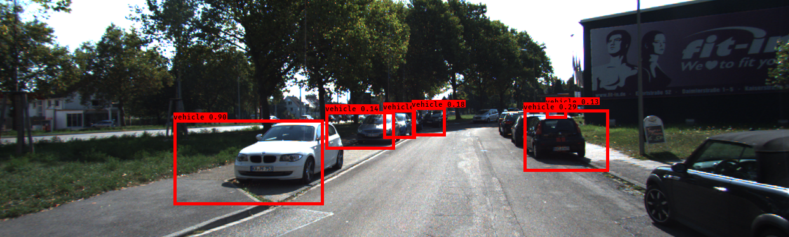
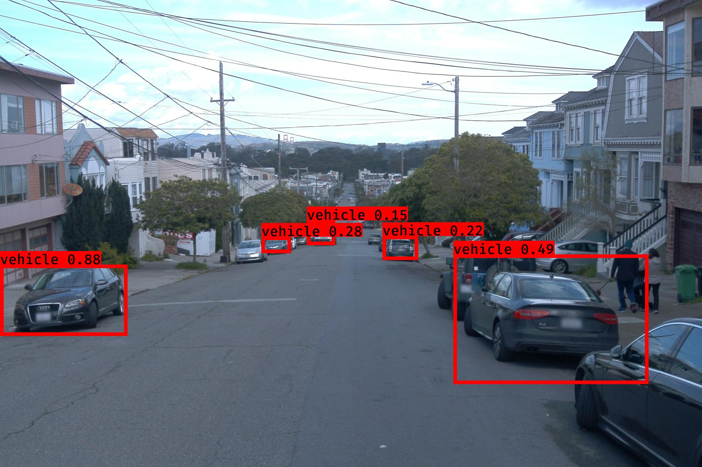
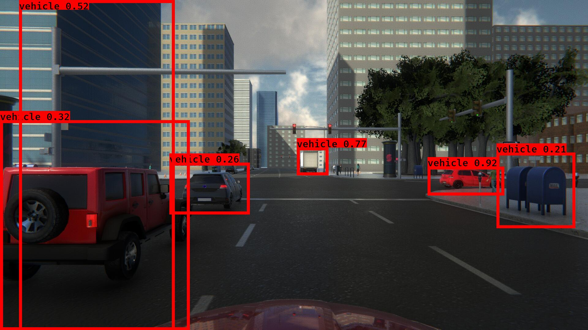
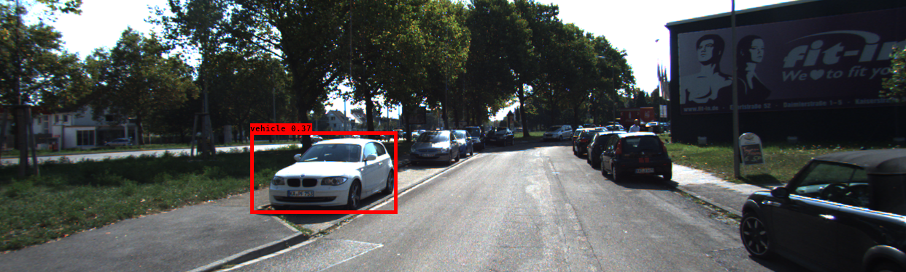
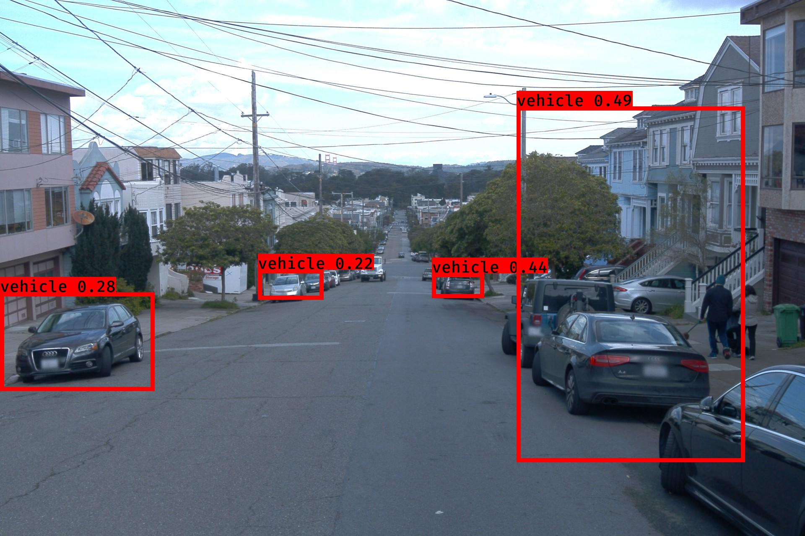
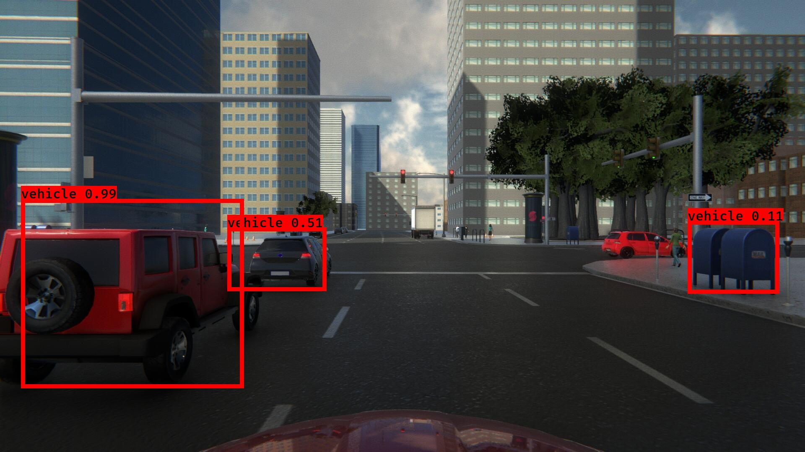
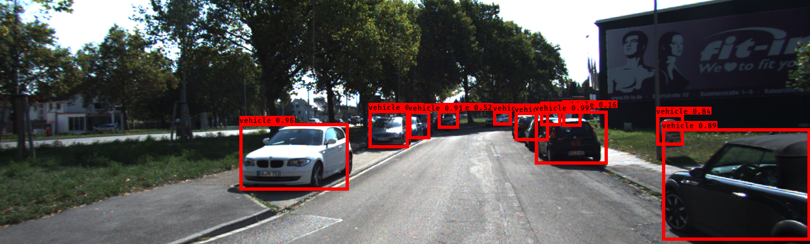
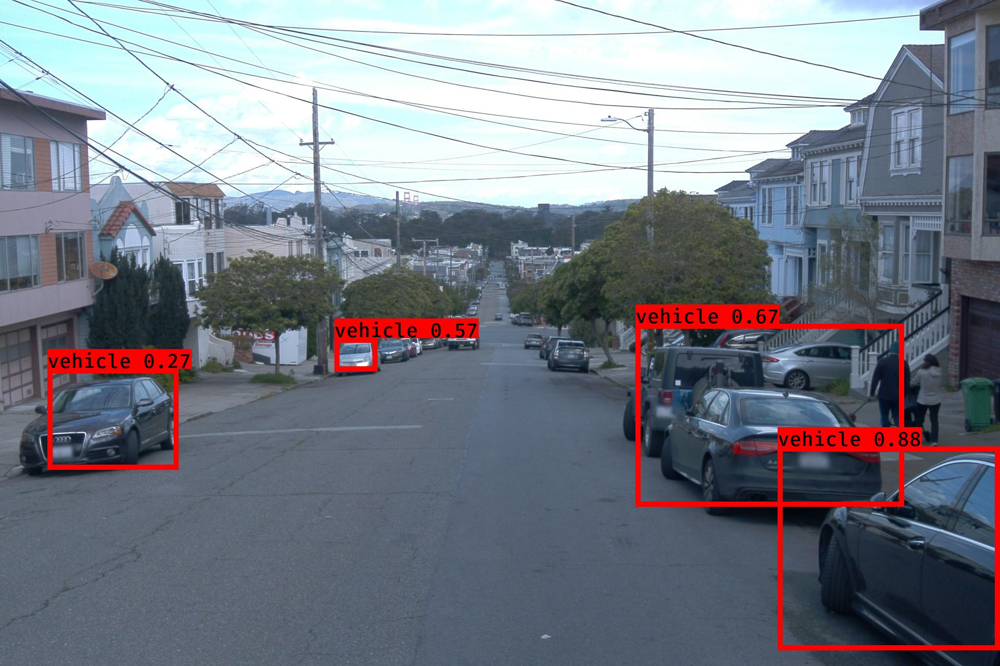

# CMPE 256 - Fall 2019 Project: Team Surreal
## Evaluating Validity of Synthetic data in Perception tasks for Autonomous Vehicles

The original implementation of YOLOv3 comes from [qqwweee/keras-yolo3](https://github.com/qqwweee/keras-yolo3). This repository contains the modified implementation for the datasets mentioned below and in the project report. This repository also contains code for data collection from LGSVL Simulators written as ROS (Robot Operating System) Nodes, as well as data processing and evaluation scripts.

## Introduction
This repository provides code for the implementation of the project __Evaluating Validity of Synthetic data in Perception tasks for Autonomous Vehicles__ implemented as the final project for CMPE 256 Fall 2019 by Team Surreal. In this project, we aim to determine if data generated from simulated 3D environments can be generalized to real-world test datasets. Here, we provide code for the following tasks:
* Collecting data from the simulation environments.
* Extracting data from Waymo Open Dataset and converting it to our format.
* Extracting data from KITTI Vision benchmark dataset and converting it to our format.
* Training YOLOv3 Object detection algorithm on these datasets.
* Running inference of trained models on test datasets.
* Evaluating performance of inference using the mean average precision (mAP).

## Data Collection
### Simulated Datasets
For this project, we collected data from two different versions of LGSVL Automotive Simulator by writing ROS Nodes and connecting to the simulators over ROS Bridge. For more details on how the LGSVL Simulator works please visit the links below

#### [LGSVL 2019.05 Release (Sim1)](https://github.com/lgsvl/simulator-2019.05-obsolete)
#### [LGSVL 2019.10 Release (Sim2)](https://github.com/lgsvl/simulator)

The ROS packages written for collected data from the above mentioned simulators are provided in [ros_workspace](ros_workspace) folder. If you wish to run them, please install ROS Kinetic Kame and run `catkin_make` to build these packages.

If you wish to download the collected datasets please download the zip files linked below

#### [LGVSL Sim1 Dataset](https://www.dropbox.com/s/nhbwk2gqulnkodi/lgsvl_1_dataset_2.zip?dl=0)
#### [LGSVL Sim2 Dataset](https://www.dropbox.com/s/zh603pabvakt2i9/lgsvl_2_dataset_3.zip?dl=0)

These zip files contain the front camera 2D images as well as the ground truth information in a single CSV file.

### Real-World Datasets
### Waymo Dataset: Extracting into Google Cloud Project buckets
1. Download the waymo dataset files(first 3 only for images training) [here](https://waymo.com/open/download/#)
2. Extract the tar file to get the list of segments.
3. Submit the path of all the segments to [training_data_to_gcs.ipynb](https://github.com/saching13/Validation-of-Synthetic-Image-data-for-Autonomous-Driving/blob/master/training_data_to_gcs.ipynb) or [validation_to_gcs.ipynb](https://github.com/saching13/Validation-of-Synthetic-Image-data-for-Autonomous-Driving/blob/master/validation_to_gcs.ipynb)
4. Update the cloud bucket path in the notebook to write the extracted images, tf records and annotation file to google cloud storage.

#### [Training_data_to_gcs.ipynb](https://github.com/saching13/Validation-of-Synthetic-Image-data-for-Autonomous-Driving/blob/master/training_data_to_gcs.ipynb) 
This files takes list of tfrecords of waymo from local or gcp buckets as input and creates tfrecords in the the cloud buckets.

#### [validation_to_gcs.ipynb](https://github.com/saching13/Validation-of-Synthetic-Image-data-for-Autonomous-Driving/blob/master/validation_to_gcs.ipynb)
This files also takes list of tfrecords of waymo from local or gcp buckets as input and creates tfrecords along with jpeg files and annotation file in the the cloud bucket.

#### TFRecord prototxt format:
TFRecord of waymo had more information including LIDAR scan with their own proto format. we simplified it to the following format with only images and it's annotations.

Our TFrecord format.
```

feature={
      'image/filename': dataset_util.bytes_feature(filename),
      'image/format': dataset_util.bytes_feature(image_format),
      'image/encoded': dataset_util.bytes_feature(encoded_image_data),
      'image/object/bbox/center_x': dataset_util.float_list_feature(center_x),
      'image/object/bbox/center_y': dataset_util.float_list_feature(center_y),
      'image/object/bbox/width': dataset_util.float_list_feature(width),
      'image/object/bbox/height': dataset_util.float_list_feature(height),
      'image/object/class/text': dataset_util.bytes_list_feature(classes_text),
      'image/object/class/label': dataset_util.int64_list_feature(classes),
  }

```

### KITTI Dataset: Converting KITTI dataset to YOLOV3 finput format

1. KITTI dataset is a stero camera dataset.
2. Dataset is of the format that each image contains it's individual text file which contains the class name, bounding box and other information.
3. we needed to convert it into single annotation file with bounding box, class. 
4. pass the list of annotation files of kitti dataset into [annotation_converter_kitti.py](https://github.com/saching13/Validation-of-Synthetic-Image-data-for-Autonomous-Driving/blob/master/annotation_converter_kitti.py) to create a single annotation file.

KITTI dataset can be found [here](http://www.cvlibs.net/datasets/kitti/eval_object.php?obj_benchmark=2d)

#### [image annotator.ipynb](https://github.com/saching13/Validation-of-Synthetic-Image-data-for-Autonomous-Driving/blob/master/image%20annotator.ipynb)

  On passsing the images folder path  and annotation file with bounding boxes it will generate images with bounding boxes for visualization. set `gcs = False` to create the output files in local file system and `True` to create files in GCP.

## Training
1. We generated our own annotation file and class names file according to the following format  
    One row for one image;  
    Row format: `image_file_path box1 box2 ... boxN`;  
    Box format: `x_min,y_min,x_max,y_max,class_id` (no space).  
    Here is an example:
    ```
    path/to/img1.jpg 50,100,150,200,0 30,50,200,120,3
    path/to/img2.jpg 120,300,250,600,2
    ...
    ```

2. We then calculated the correct anchors for each of our datasets using [kmeans.py](kmeans.py) script. These anchors are then placed into the anchors file provided for training.

3. To start training, we modified the [train.py](train.py) file with the correct image sizes, anchor sizes, class names, starting weights as well as hyper-parameters. We started with pretrained YOLOv3 weights. These weights can be downloaded [here](https://www.dropbox.com/s/a44ly3zd6bzmssw/2d-final-weights-keras-yolo3.h5?dl=0).

4. The progress of the trainings can be looked at through TensorBoard.

5. If you wish to use our training weights you can find them here:
* [Model trained on LGSVL Sim1 dataset](https://www.dropbox.com/s/jlevzz3yf4urbr4/lgsvl_1trained_weights_final.h5?dl=0)
* [Model trained on LGSVL Sim2 dataset](https://www.dropbox.com/s/18xi1ljwfvjlx2x/000trained_weights_final.h5?dl=0)
* [Model trained on LGSVL KITTI dataset](https://www.dropbox.com/s/edg06gy1le529ai/kitti_epoch_final_30iter_unfreeze_all.h5?dl=0)

## Inference
After training has been performed and suitable weights are generated, we can begin the inference process on the different testsets. Inference can be run on the entire testset using [test_set_inference.py](test_set_inference.py). This file will pass each image through the trained network and draw detections as boxes on the images. The images as well as the detections will be saved. The detections saved in a single CSV file is then used to evaluate the mean average precision.

## Evaluation
For evaluation, we used the mean average precision metric. This metric is calculated by comparing the ground truth boxes with the detections boxes and calculating the Intersection over Union (IoU). This IoU is then used to calculate the number of True Positives and False Positives, which in turn can be used to calcualte average precision. Mean Average precision is the mean of all AP values over all classes. Please see this repository for more details on our implementation: [https://github.com/Naveen-Ravipati/mAP](https://github.com/Naveen-Ravipati/mAP).

## Results
This section shows sample images from inference of our trained models on our test datasets. Each section shows the inference results of one trained model on images taken from the four testsets.

### 1. Model trained on __LGSVL Sim1__ dataset produces the following results on the given testsets
#### Tested on LGSVL Sim1 testset
  

#### Tested on LGSVL Sim2 testset
  

#### Tested on KITTI testset
 

#### Tested on Waymo testset


### 2. Model trained on __LGSVL Sim2__ dataset produces the following results on the given testsets
#### Tested on LGSVL Sim1 testset
  

#### Tested on LGSVL Sim2 testset
  

#### Tested on KITTI testset
 

#### Tested on Waymo testset


### 3. Model trained on __KITTI__ dataset produces the following results on the given testsets
#### Tested on LGSVL Sim1 testset
  

#### Tested on LGSVL Sim2 testset
  

#### Tested on KITTI testset
 

#### Tested on Waymo testset


<!-- ### Images


 -->

<!-- ### Video - Real-time inference on frames captured from the Simulator
[](https://www.youtube.com/watch?v=DwWY89dVGEw) -->

## Contributors
* **Deepak Talwar** - (https://github.com/deepaktalwardt)
* **Sachin Guruswamy** - (https://github.com/swdev1202)
* **Naveen Ravipati** - (https://github.com/Naveen-Ravipati)
### This repository was developed for CMPE 256 - Large Scale Analytics at San Jose State University in Fall 2019.
